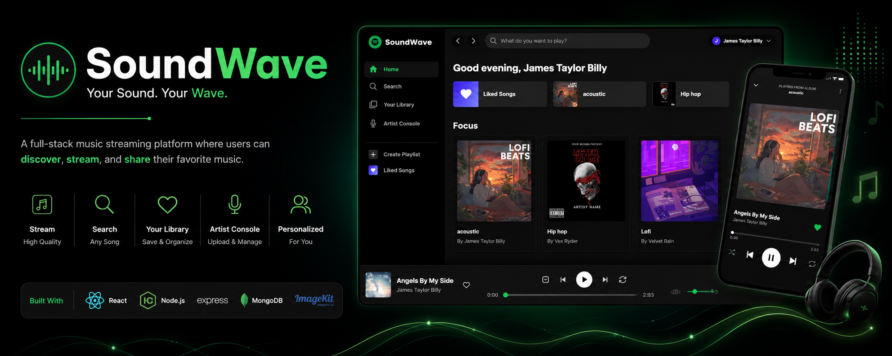
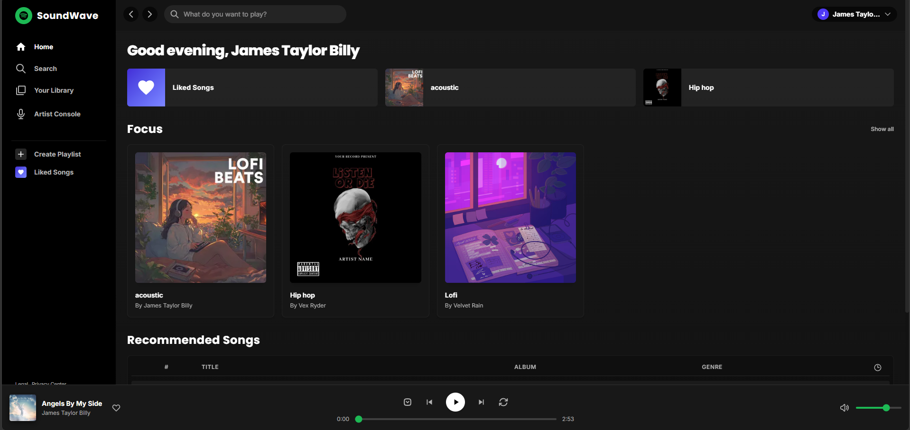
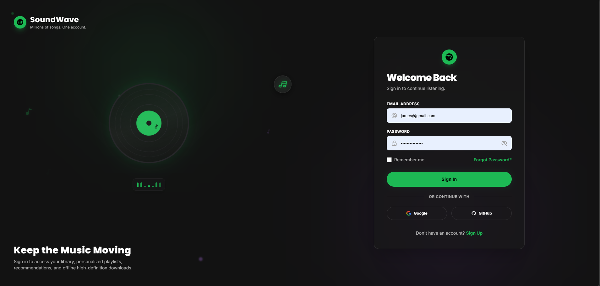
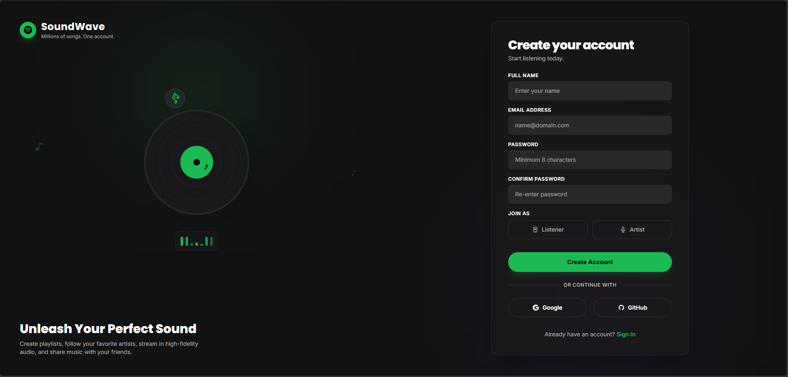
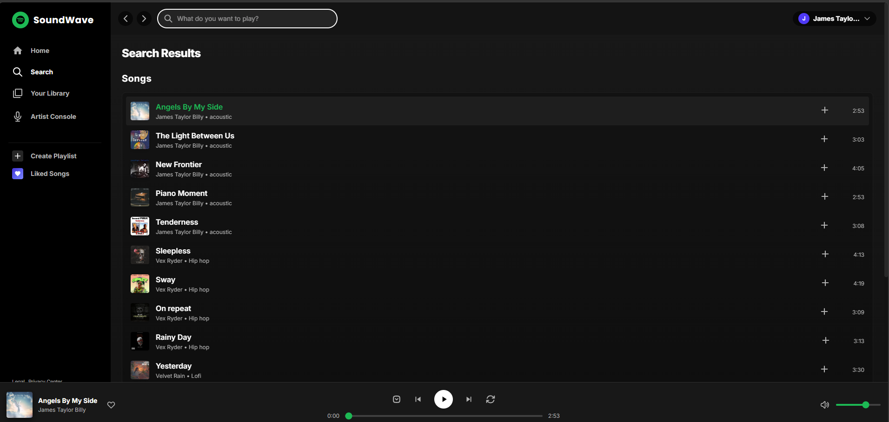
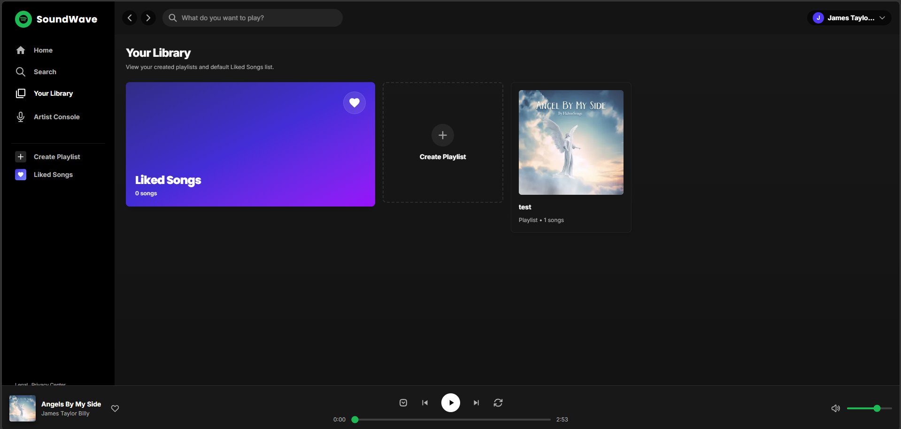
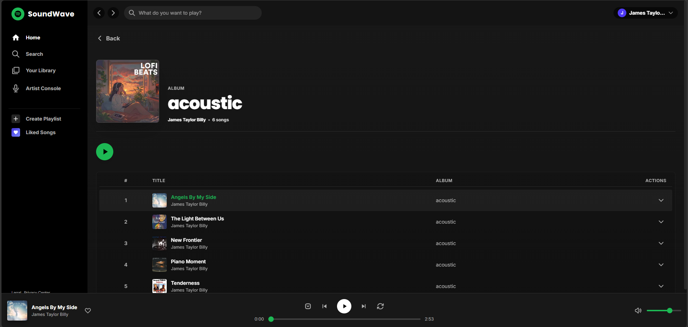
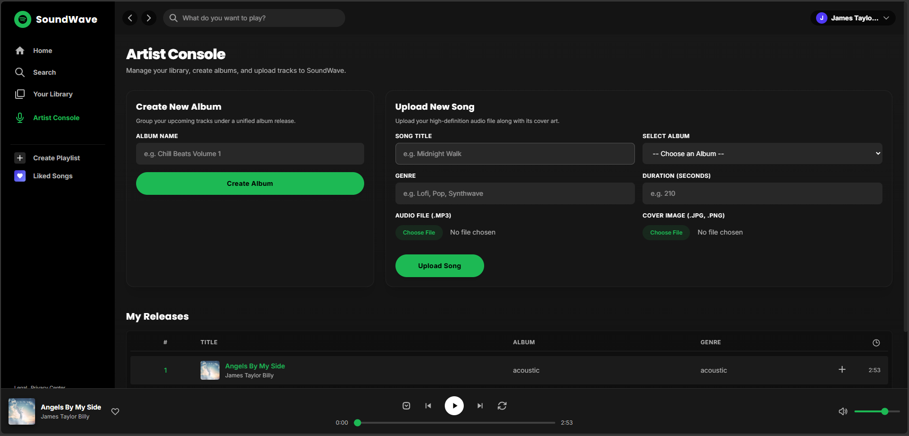

<p align="center">
  
</p>

<h1 align="center">🎵 SoundWave</h1>

<p align="center">
  A Full-Stack Spotify Inspired Music Streaming Platform
</p>

<p align="center">
  Stream Music • Create Playlists • Upload Songs • Discover Artists
</p>

<p align="center">
  
  
  
  
  
</p>

<p align="center">
  <a href="YOUR_VERCEL_URL">
    
  </a>
  <a href="./demo.mp4">
    
  </a>
</p>

---

# 📖 About The Project

SoundWave is a full-stack Spotify-inspired music streaming platform built using the MERN stack.

The platform allows users to discover, search, and stream songs while enabling artists to upload music, create albums, and manage their content through a dedicated Artist Console.

The application supports role-based authentication, playlist management, album browsing, personalized recommendations, and media storage using ImageKit.

---

# 🎥 Demo Video

<p align="center">
  <a href="./demo.mp4">
    
  </a>
</p>

<p align="center">
  <b>▶ Click the image above to watch the complete demo video.</b>
</p>

---

# 🚀 Live Demo

* Frontend: vercel
* Backend API: Render
* Demo Video: demo.mp4

---

# ✨ Features

## 🎧 Listener Features

* User Registration and Login
* JWT Authentication
* Search songs and artists
* Play and pause music
* Next and previous controls
* Like songs
* Create playlists
* Listen to albums
* Personalized recommendations
* Responsive music player
* Persistent user sessions

## 🎤 Artist Features

* Artist Registration
* Artist Authentication
* Artist Console
* Upload songs
* Create albums
* Manage releases
* Upload cover images
* Role-based access

---

# 🛠 Tech Stack

## Frontend

* React.js
* Tailwind CSS
* Redux Toolkit
* React Router DOM
* Axios

## Backend

* Node.js
* Express.js
* MongoDB
* Mongoose
* Multer
* JWT Authentication
* REST API
* ImageKit

## Deployment

* Vercel
* Render
* MongoDB Atlas
* ImageKit

---

# 📸 Application Screenshots

## 🔐 Login Page

<p align="center">
  
</p>

---

## 📝 Registration Page

<p align="center">
  
</p>

---

## 🏠 Home Dashboard

<p align="center">
  
</p>

---

## 🔍 Search Songs

<p align="center">
  
</p>

---

## ❤️ Library & Playlists

<p align="center">
  
</p>

---

## 🎵 Playlist Page

<p align="center">
  
</p>

---

## 🎤 Artist Console

<p align="center">
  
</p>

---

# 📁 Project Structure

```text
Spotify
│
├── Backend
│   ├── src
│   │   ├── controllers
│   │   ├── DB
│   │   ├── middlewares
│   │   ├── models
│   │   ├── routes
│   │   └── services
│   ├── server.js
│   └── package.json
│
├── Frontend
│   ├── src
│   │   ├── components
│   │   ├── pages
│   │   ├── redux
│   │   └── assets
│   ├── App.jsx
│   └── package.json
│
├── screenshots
├── banner.png
├── demo.mp4
└── README.md
```

---

# 🗄 Database Collections

* Users
* Music
* Albums
* Playlists
* Liked Songs

---

# 🎵 Media Storage

Audio files and cover images are stored using ImageKit.

MongoDB stores application data along with ImageKit URLs.

---

# 🔐 Authentication & Authorization

* JWT Authentication
* Cookie-Based Authentication
* Protected Routes
* Role-Based Access Control
* Listener Accounts
* Artist Accounts

---

# ⚙ Installation

## Clone Repository

```bash
git clone https://github.com/AdityaSarse/BackendLearning.git
cd Spotify
```

## Backend Setup

```bash
cd Backend
npm install
npm run dev
```

## Frontend Setup

```bash
cd Frontend
npm install
npm run dev
```

---

# 🔑 Environment Variables

Create a `.env` file inside the Backend directory.

```env
MONGO_URI=
JWT_SECRET=
IMAGEKIT_PUBLIC_KEY=
IMAGEKIT_PRIVATE_KEY=
URL_ENDPOINT=
```

---

# 🚀 Future Improvements

* AI-powered recommendations
* Recently played songs
* User profiles
* Comments and reviews
* Real-time notifications
* Mobile application
* Listening history
* Social features

---

# 👨‍💻 Author

## Aditya Sarse

Full Stack Developer

### Tech Stack

* React.js
* Node.js
* Express.js
* MongoDB
* Tailwind CSS
* Redux Toolkit

---

<p align="center">
  ⭐ If you like this project, consider giving it a star.
</p>
